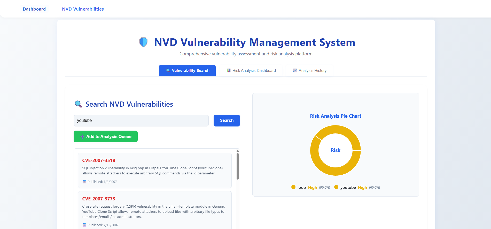

# ⚠️ Sistema de Gestión de Riesgos Cuantitativo

Una aplicación full-stack basada en microservicios para **evaluación y mitigación cuantitativa de riesgos**, potenciada por **Aprendizaje Automático** y **Programación Dinámica**. Este sistema predice riesgos potenciales, evalúa su impacto y recomienda estrategias de mitigación óptimas utilizando algoritmos inteligentes e insights basados en datos.



*Captura de pantalla: Sistema de Gestión de Vulnerabilidades NVD con dashboard integral de análisis de riesgos, que incluye interfaz con pestañas para búsqueda de vulnerabilidades, configuración de evaluación de riesgos y categorización de activos a nivel empresarial.*

---

## ✨ Características

- 🎯 **Predicción Avanzada de Riesgos** utilizando modelos de ML entrenados (CICIDS, LANL)
- 🧠 **Motor de Programación Dinámica** para toma de decisiones óptima
- 📊 **Dashboard Interactivo** construido con React + Tailwind CSS
- 🔄 **APIs RESTful** potenciadas por FastAPI (Python)
- 🐳 **Completamente Contenerizado** con Docker & Docker Compose
- 📁 **Integración con Base de Datos PostgreSQL**
- 📈 **Visualización de Datos** con Chart.js y componentes SVG personalizados
- 🛡️ **Integración NVD** con la API de la Base de Datos Nacional de Vulnerabilidades (NVD)
- 🏛️ **Arquitectura de Microservicios** con API Gateway
- 🔍 **Búsqueda Integral de Vulnerabilidades** con filtrado basado en palabras clave
- 📋 **Sistema de Gestión de Cola** con RabbitMQ para procesamiento asíncrono
- 🎛️ **Configuración de Evaluación de Riesgos** con umbrales personalizables
- 🏢 **Categorización de Activos Empresariales** (Aplicaciones Web, Infraestructura, Bases de Datos, etc.)
- 📊 **Análisis de Impacto Empresarial** con algoritmos de puntuación ponderada
- 📈 **Seguimiento del Historial de Análisis** para auditoría y cumplimiento
- 🎨 **Interfaz Moderna y Responsiva** con interfaz de pestañas y actualizaciones en tiempo real

---

## 🧱 Stack Tecnológico

| Capa         | Tecnología         |
|-------------|--------------------|
| Frontend    | React, Tailwind CSS, Axios, Chart.js |
| Backend     | FastAPI (Python), Scikit-learn, Lógica de Programación Dinámica |
| API Gateway | FastAPI (Python), httpx |
| Base de Datos | PostgreSQL         |
| DevOps      | Docker, Docker Compose |
| Otros       | REST API, Pydantic, Vite (o CRA) |

---

## 🏗️ Arquitectura

- **API Gateway** (FastAPI): Punto de entrada central, enruta solicitudes a microservicios backend.
- **Microservicio Backend** (FastAPI): Maneja predicciones de ML, lógica de PD y operaciones de base de datos.
- **Frontend** (React): Interfaz de usuario para análisis y visualización de riesgos.
- **Base de Datos** (PostgreSQL): Almacena resultados de análisis de riesgos y datos de usuario.

Todos los servicios están contenerizados y orquestados con Docker Compose.

---

## 🛡️ Sistema de Gestión de Vulnerabilidades NVD

Nuestra integración mejorada de NVD proporciona evaluación integral de vulnerabilidades y gestión de riesgos empresariales:

### 🔍 **Búsqueda y Descubrimiento**
- Búsqueda de vulnerabilidades en tiempo real usando la API de NVD
- Filtrado basado en palabras clave para tecnologías específicas
- Información detallada de CVE con fechas de publicación y descripciones

### 📊 **Dashboard de Análisis de Riesgos** 
- **Interfaz con Pestañas**: Vistas de Búsqueda, Análisis e Historial
- **Configuración de Evaluación de Riesgos**: Umbrales personalizables (Crítico: 80%, Alto: 60%, Medio: 40%, Bajo: 20%, Muy Bajo: 10%)
- **Gestión de Cola**: Agregar vulnerabilidades específicas a la cola de análisis
- **Métricas Empresariales**: Análisis integral del impacto empresarial

### 🏢 **Categorización de Activos Empresariales**
- **Aplicaciones Web**: React, Vue, Angular, JavaScript, Node.js
- **Infraestructura**: Apache, Nginx, Docker, Kubernetes, Linux, Windows  
- **Bases de Datos**: MySQL, PostgreSQL, MongoDB, Redis, Oracle
- **Herramientas de Desarrollo**: Git, Jenkins, Python, Java, PHP, Ruby
- **Herramientas de Seguridad**: OpenSSL, SSH, SSL/TLS, Crypto, Vault

### 📈 **Análisis de Impacto Empresarial**
- Algoritmos de puntuación ponderada basados en la criticidad de activos
- Clasificación automática del nivel de riesgo (Crítico, Alto, Medio, Bajo, Muy Bajo)
- Agregación y reporte de riesgos a nivel empresarial
- Recomendaciones accionables basadas en la evaluación de riesgos

### 🔄 **Procesamiento Basado en Colas**
- Integración con RabbitMQ para procesamiento asíncrono de vulnerabilidades
- Análisis selectivo - solo analizar elementos explícitamente encolados
- Monitoreo del estado de cola en tiempo real
- Capacidades de análisis masivo

---

## 📂 Estructura del Proyecto

```
Quantitative_Risk_Management/
├── backend/
│   └── app/
│       ├── api/          # Rutas y Esquemas (FastAPI)
│       ├── ml/           # Modelos de ML y helpers
│       ├── dp/           # Motor de programación dinámica
│       ├── database/     # Modelos CRUD y ORM
│       └── main.py       # Punto de entrada FastAPI
├── frontend/
│   └── src/
│       ├── components/   # UI Reutilizable
│       ├── pages/        # Vistas
│       ├── services/     # Llamadas API
│       └── App.jsx
├── api_gateway/
│   └── api_gateway.py    # API Gateway FastAPI para microservicios
│   └── Dockerfile
├── docker-compose.yml
└── README.md
```

---

## 🚀 Comenzando

### 1. Clonar el repositorio

```bash
git clone https://github.com/your-username/quantitative_risk_managment.git
cd quantitative_risk_managment
```

### 2. Ejecutar con Docker

```bash
docker-compose up --build
```

Esto iniciará:
- `frontend` en [http://localhost:5173](http://localhost:5173)
- `gateway` (API Gateway) en [http://localhost:8080](http://localhost:8080)
- `backend` en [http://localhost:8000](http://localhost:8000)
- `PostgreSQL` en el puerto 5432

---

## 🧠 Cómo Funciona

1. El **API Gateway** (FastAPI) recibe todas las solicitudes del frontend y las enruta al microservicio backend apropiado (predicción de riesgos, NVD, etc.).
2. El **Backend** (FastAPI) expone endpoints para predicciones de ML (CICIDS, LANL), programación dinámica y operaciones de base de datos.
3. El **motor de ML** predice la probabilidad y severidad de un riesgo basado en características de entrada.
4. El **optimizador de PD** calcula la mejor estrategia de mitigación bajo restricciones como presupuesto e impacto.
5. Los resultados se visualizan y almacenan en la base de datos.
6. Los usuarios interactúan con predicciones y optimizaciones a través del dashboard de React.

---

## 🏛️ Patrones de Diseño Utilizados

- **Factory Method:** Utilizado en `ml/engine.py` (`PredictionFactory`) para instanciar la estrategia de predicción correcta (CICIDS, LANL) basada en la entrada.
- **Strategy:** La clase base abstracta `PredictionStrategy` permite lógica de predicción intercambiable para diferentes modelos.
- **Singleton:** Cada estrategia de modelo (`CICIDSPredictionStrategy`, `LANLPredictionStrategy`) se carga solo una vez por proceso, asegurando uso eficiente de recursos.

---

## ⚙️ Gestión de Configuración

- Todos los secretos y configuraciones (URL de base de datos, claves API, rutas de modelos, configuraciones de cola) se gestionan a través de variables de entorno y `backend/app/config.py`.
- No hay secretos o credenciales hardcodeados en el código base.

---

## 🩺 Observabilidad y Verificaciones de Salud

- El logging está habilitado en todo el backend para carga de modelos, errores y operaciones de cola.
- Todos los endpoints de predicción incluyen manejo de errores y registro de fallos.
- El endpoint `/health` está disponible para verificaciones de salud.

---

## 📨 Integración de Cola de Mensajes

- El backend integra una cola de mensajes (stub en `backend/app/queue.py`) para procesamiento asíncrono (ej., logging de predicciones, tareas por lotes).
- Listo para Azure Service Bus o una alternativa local (ver `QUEUE_CONNECTION_STRING` y `QUEUE_NAME` en config).
- Ejemplo: Los resultados de predicción combinados se envían a la cola para procesamiento asíncrono.

---

## 🔒 Seguridad y Mejores Prácticas

- Todo el código, comentarios y documentación técnica están en inglés para compatibilidad internacional.
- Backend modular, testeable y extensible usando inyección de dependencias y patrones de diseño.
- No hay datos sensibles en el código fuente o imágenes Docker.

---

## 🌐 Integración con la API de la Base de Datos Nacional de Vulnerabilidades (NVD)

Este proyecto se integra con la API de la [Base de Datos Nacional de Vulnerabilidades (NVD)](https://nvd.nist.gov/), proporcionada por el Instituto Nacional de Estándares y Tecnología de EE.UU. (NIST).

> La NVD es el repositorio del gobierno de EE.UU. de datos de gestión de vulnerabilidades basados en estándares, que permite la automatización de la gestión de vulnerabilidades, medición de seguridad y cumplimiento.  
> La NVD incluye bases de datos de referencias de listas de verificación de seguridad, fallas de software, nombres de productos y métricas de impacto, y enriquece los CVE con metadatos adicionales como puntuaciones CVSS, CWE y declaraciones de aplicabilidad CPE.

- **Documentación de la API:** [API de NVD](https://nvd.nist.gov/developers/vulnerabilities)
- **Descargo Legal:** La NVD es un producto de la División de Seguridad Informática de NIST, Laboratorio de Tecnología de la Información. La NVD no realiza activamente pruebas de vulnerabilidades, dependiendo de proveedores, investigadores de seguridad de terceros y coordinadores de vulnerabilidades para proporcionar información.
- **Créditos:**  
  - Base de Datos Nacional de Vulnerabilidades (NVD), Laboratorio de Tecnología de la Información, NIST  
  - [Descargo Legal de NVD](https://nvd.nist.gov/general/disclaimer)

---

## 🛣️ Endpoints del API Gateway

Todas las solicitudes del frontend se enrutan a través del API Gateway. Endpoints principales:

| Método | Endpoint                    | Descripción                           |
|--------|-----------------------------|---------------------------------------|
| POST   | /predict/cicids/            | Predecir riesgo usando modelo CICIDS  |
| POST   | /predict/lanl/              | Predecir riesgo usando modelo LANL    |
| POST   | /predict/combined/          | Predicción de riesgo combinada        |
| GET    | /nvd                        | Buscar vulnerabilidades NVD          |
| POST   | /nvd/add_to_queue          | Agregar palabra clave a cola de análisis |
| POST   | /nvd/analyze_risk          | Analizar vulnerabilidades en cola    |
| POST   | /nvd/enterprise_metrics    | Obtener métricas de riesgo empresarial |
| GET    | /nvd/queue_status          | Obtener estado actual de cola         |
| POST   | /nvd/clear_queue           | Limpiar cola de análisis              |
| GET    | /health                     | Verificación de salud                 |

---

## 🌐 API Gateway y CORS

- El API Gateway (FastAPI) es el único punto de entrada para todas las llamadas API del frontend.
- CORS está habilitado para permitir solicitudes desde el frontend (ver `main.py` en `api_gateway`).
- Configura la URL base de la API de tu frontend al gateway:
  
  ```env
  VITE_API_URL=http://localhost:8080
  ```

---

## 🧠 Archivos de Modelos y Configuración

- Los archivos de modelos entrenados deben estar presentes en `backend/app/ml/`:
    - `isolation_forest_model.pkl`
- El backend espera estos archivos en `/app/ml/` dentro del contenedor Docker.
- Puedes sobrescribir las rutas con variables de entorno `CICIDS_MODEL_PATH` y `LANL_MODEL_PATH` si es necesario.

---

## ⚙️ Ejemplo de Variables de Entornoo

```env
# .env para frontend
VITE_API_URL=http://localhost:8080

# docker-compose.yml para backend/gateway
DATABASE_URL=postgresql://postgres:postgres@db:5432/postgres
NVD_API_KEY=tu-clave-api-nvd
CICIDS_MODEL_PATH=/app/ml/rf_cicids2017_model.pkl
LANL_MODEL_PATH=/app/ml/isolation_forest_model.pkl
```

---

## 🛠️ Solución de Problemas

- **Errores CORS/Preflight:** Asegúrate de que el middleware CORS esté habilitado en el API Gateway (`main.py`).
- **Archivo de modelo no encontrado:** Asegúrate de que los archivos de modelos existan en `backend/app/ml/` y estén copiados en la imagen Docker.
- **Errores de importación:** Elimina cualquier archivo local que haga sombra a módulos de la biblioteca estándar (ej., `queue.py`).
- **404 del Frontend en /nvd:** No visites `/nvd` directamente en el navegador; usa la navegación de la aplicación.

---

## 🔄 Desarrollo y Recarga en Caliente

- Para desarrollo local, puedes ejecutar cada servicio por separado y usar `docker-compose` para orquestación.
- Reconstruye contenedores después de cambiar dependencias o rutas de modelos:
  
  ```sh
  docker compose up -d --build
  ```

---

## 🆕 Mejoras Recientes (2025)

### 🛡️ **Gestión Mejorada de Vulnerabilidades NVD**
- **Interfaz con Pestañas**: Rediseño completo con pestañas de Búsqueda, Análisis e Historial
- **Matriz de Riesgo de Activos Empresariales**: Evaluación integral de riesgos con análisis de impacto empresarial
- **Procesamiento Selectivo de Cola**: Solo analizar vulnerabilidades explícitamente agregadas a la cola
- **Configuración de Umbrales de Riesgo**: Configuraciones personalizables de apetito de riesgo (Crítico, Alto, Medio, Bajo, Muy Bajo)
- **Historial de Análisis**: Rastrear y auditar todas las evaluaciones de riesgo para cumplimiento

### 🏢 **Características de Nivel Empresarial**
- **Categorización de Activos**: Clasificación automática de activos por tipo (Aplicaciones Web, Infraestructura, Bases de Datos, Herramientas de Desarrollo, Seguridad)
- **Puntuación de Impacto Empresarial**: Algoritmos ponderados para calcular la exposición al riesgo a nivel empresarial
- **Recomendaciones Automatizadas**: Sugerencias impulsadas por IA basadas en los resultados de evaluación de riesgos
- **Reportes Integrales**: Métricas empresariales con capacidades de análisis detallado

### 🎨 **Mejoras Modernas de UI/UX**
- **Diseño Responsivo**: Layout de pantalla completa que se adapta a todos los tamaños de pantalla
- **Diseño Centrado**: Apariencia profesional con distribución óptima de contenido
- **Componentes Interactivos**: Gráficos circulares SVG personalizados y visualización de datos en tiempo real
- **Navegación Mejorada**: Interfaz intuitiva con pestañas y jerarquía visual clara

### 🔄 **Mejoras de Arquitectura Backend**
- **Integración con RabbitMQ**: Cola de mensajes real para búsquedas de vulnerabilidades NVD con procesamiento asíncrono confiable
- **Dockerización Robusta**: Todos los servicios (backend, gateway, frontend, RabbitMQ, PostgreSQL) completamente contenerizados
- **Mejora del API Gateway**: Cobertura completa de endpoints con inyección de dependencias y abstracción de servicios
- **Gestión de Cola**: Conexión lazy con lógica de reintentos, previniendo fallas cuando RabbitMQ no está listo

### 🐳 **DevOps e Infraestructura**
- **Optimización de Docker**: Dockerfiles mejorados con gestión adecuada de PYTHONPATH y dependencias
- **Configuración CORS**: Comunicación fluida frontend-backend a través del API gateway
- **Manejo de Errores**: Manejo mejorado de errores para conexiones de cola y enrutamiento de API
- **Monitoreo de Salud**: Logging integral y endpoints de verificación de salud

### 🔧 **Resolución de Deuda Técnica**
- **Estandarización de Importaciones**: Todas las importaciones del backend estandarizadas para evitar ModuleNotFoundError de Docker
- **Sincronización de Estado**: Estado del frontend sincronizado apropiadamente con operaciones de cola del backend
- **Calidad de Código**: Manejo mejorado de errores, logging y organización de código
- **Seguridad**: Sin credenciales hardcodeadas, toda la configuración vía variables de entorno

---

## 👨‍💻 Autor

**Stefan Jativa** — [@byPronox](https://github.com/byPronox)  
*Entusiasta de Machine Learning | Ingeniero de Software*

---

## 📄 Licencia

Licencia MIT © 2025 Stefan Jativa

---

## 📚 Referencias y Créditos

### Dataset de Autenticación de LANL

- **Fuente:** [Datos de Autenticación del Laboratorio Nacional de Los Álamos](https://csr.lanl.gov/data/auth/)
- **Licencia:** CC0 — En la medida de lo posible bajo la ley, el Laboratorio Nacional de Los Álamos ha renunciado a todos los derechos de autor y derechos relacionados o vecinos a las Asociaciones de Autenticación Usuario-Computadora en el Tiempo. Este trabajo se publica desde: Estados Unidos.
- **Citas:**
  - A. Hagberg, A. Kent, N. Lemons, and J. Neil, “Credential hopping in authentication graphs,” in 2014 International Conference on Signal-Image Technology Internet-Based Systems (SITIS). IEEE Computer Society, Nov. 2014.
  - A. D. Kent, “User-computer authentication associations in time,” Los Alamos National Laboratory, http://dx.doi.org/10.11578/1160076, 2014.

### Dataset CICIDS2017

- **Fuente:** [Dataset de Evaluación de Detección de Intrusos CICIDS2017](https://www.unb.ca/cic/datasets/ids-2017.html)
- **Licencia:** El dataset CICIDS2017 está disponible públicamente para propósitos de investigación.
- **Citas:**
  - Iman Sharafaldin, Arash Habibi Lashkari, and Ali A. Ghorbani, “Toward Generating a New Intrusion Detection Dataset and Intrusion Traffic Characterization”, 4th International Conference on Information Systems Security and Privacy (ICISSP), Portugal, January 2018.

---

*Todos los activos de datasets y muestras utilizados en este proyecto están acreditados a sus respectivos autores e instituciones según se referencia arriba.*