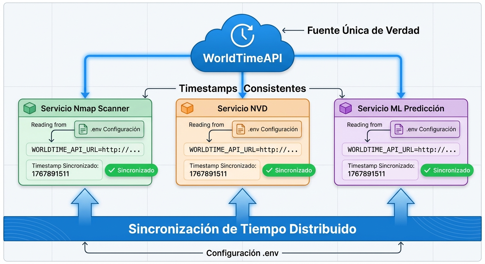
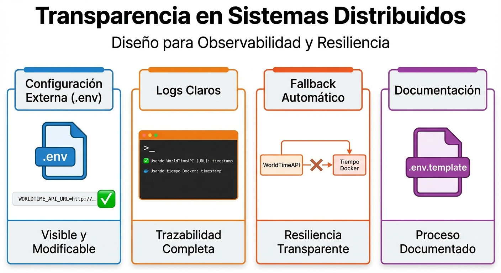
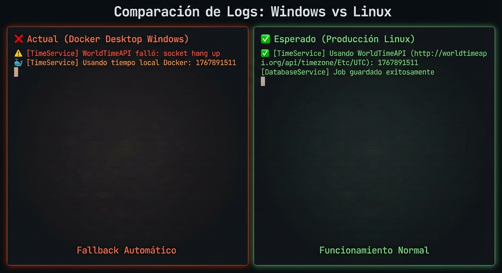

# 🌐 WorldTimeAPI: Sistema Distribuido y Transparente

## 📋 Resumen Ejecutivo

Este documento explica cómo la implementación de **WorldTimeAPI** en variables de entorno contribuye a que el Sistema de Gestión de Riesgos Cuantitativos sea un **sistema distribuido** con **transparencia** completa.

---

## 🎯 ¿Qué es un Sistema Distribuido?

Un **sistema distribuido** es un conjunto de componentes independientes que trabajan juntos para lograr un objetivo común, aparentando ser un único sistema coherente para el usuario final.

### Características Clave:

1. **Múltiples nodos independientes** (microservicios)
2. **Comunicación a través de red**
3. **Coordinación y sincronización**
4. **Tolerancia a fallos**
5. **Escalabilidad horizontal**

---

## 🏗️ Arquitectura del Sistema



Nuestro sistema consta de **múltiples microservicios independientes**:

- **Servicio Nmap Scanner** (Puerto 8004)
- **Servicio NVD Vulnerabilidades** (Puerto 8002)
- **Servicio ML Predicción** (Puerto 8001)
- **Backend Service** (Puerto 8000)
- **Frontend** (Puerto 5173)

Cada uno corre en su **propio contenedor Docker**, con su propia base de código, dependencias y ciclo de vida.

---

## ⏰ Problema: Sincronización de Tiempo en Sistemas Distribuidos

### El Desafío

En un sistema distribuido, cada nodo tiene su **propio reloj interno**. Esto puede causar:

❌ **Timestamps inconsistentes** entre servicios  
❌ **Problemas de ordenamiento** de eventos  
❌ **Dificultad para auditoría** y trazabilidad  
❌ **Conflictos en bases de datos** distribuidas  

### Ejemplo del Problema:

```
Servicio A (reloj adelantado): created_at = 1767891520
Servicio B (reloj atrasado):   processed_at = 1767891510

❌ ¡El job fue "procesado" ANTES de ser "creado"!
```

---

## ✅ Solución: WorldTimeAPI como Fuente Única de Verdad

### Single Source of Truth (Fuente Única de Verdad)

Implementamos **WorldTimeAPI** como fuente centralizada de tiempo para **todos los microservicios**:

```javascript
// time_service.js
const worldTimeUrl = process.env.WORLDTIME_API_URL;
const response = await axios.get(worldTimeUrl);
const timestamp = response.data.unixtime; // ← Mismo timestamp para TODOS
```

### Beneficios:

✅ **Timestamps consistentes** en todos los servicios  
✅ **Ordenamiento correcto** de eventos  
✅ **Auditoría precisa** de operaciones  
✅ **Sincronización** entre microservicios  

---

## 🔧 Implementación: Configuración Externa

### 1. Archivo `.env` (Raíz del Proyecto)

```bash
# WorldTime API Configuration
WORLDTIME_API_URL=http://worldtimeapi.org/api/timezone/Etc/UTC
```

**Por qué esto es importante para sistemas distribuidos:**

- ✅ **Configuración centralizada**: Un solo lugar para cambiar la fuente de tiempo
- ✅ **Independencia de código**: No hardcodeado en ningún servicio
- ✅ **Fácil migración**: Cambiar de WorldTimeAPI a otro servicio sin tocar código
- ✅ **Consistencia**: Todos los servicios usan la misma configuración

### 2. Docker Compose (Distribución de Configuración)

```yaml
# docker-compose.yml
nmap-scanner-service:
  environment:
    - WORLDTIME_API_URL=${WORLDTIME_API_URL}
```

**Distribución automática** a todos los contenedores que lo necesiten.

### 3. Código del Servicio (Lectura Dinámica)

```javascript
// Cada servicio lee la misma variable
const worldTimeUrl = process.env.WORLDTIME_API_URL || 'fallback';
```

---

## 🌟 Transparencia en Sistemas Distribuidos



La **transparencia** es un principio fundamental de sistemas distribuidos que oculta la complejidad al usuario.

### Tipos de Transparencia Implementados:

#### 1️⃣ **Transparencia de Acceso**

El usuario no necesita saber **cómo** se obtiene el tiempo:

```javascript
// API simple y consistente
const timestamp = await TimeService.getCurrentTimestamp();
// ↑ No importa si viene de WorldTimeAPI o Docker
```

#### 2️⃣ **Transparencia de Ubicación**

La fuente de tiempo puede estar en **cualquier lugar**:

```bash
# Puede ser WorldTimeAPI externo
WORLDTIME_API_URL=http://worldtimeapi.org/api/timezone/Etc/UTC

# O un servidor interno
WORLDTIME_API_URL=http://time-server.internal.com/api/time

# O un servicio cloud
WORLDTIME_API_URL=https://time.google.com/api
```

El código **no cambia**, solo la configuración.

#### 3️⃣ **Transparencia de Fallo**

Sistema con **fallback automático**:

```javascript
try {
    // Intenta WorldTimeAPI
    const response = await axios.get(worldTimeUrl);
    return response.data.unixtime;
} catch (error) {
    // Fallback transparente a Docker
    return Math.floor(Date.now() / 1000);
}
```

**El usuario nunca ve el fallo**, el sistema continúa funcionando.

#### 4️⃣ **Transparencia de Replicación**

Múltiples servicios pueden usar **la misma fuente** sin saberlo:

- Servicio Nmap Scanner → WorldTimeAPI
- Servicio NVD → WorldTimeAPI  
- Servicio ML → WorldTimeAPI

Todos obtienen el **mismo timestamp** para eventos simultáneos.

---

## 📊 Flujo de Tiempo Distribuido

### Caso de Uso: Escaneo Nmap

```
1. Usuario inicia escaneo
   ↓
2. Servicio Nmap llama TimeService.getCurrentTimestamp()
   ↓
3. TimeService lee WORLDTIME_API_URL desde .env
   ↓
4. HTTP GET → http://worldtimeapi.org/api/timezone/Etc/UTC
   ↓
5. Respuesta: {"unixtime": 1767891511}
   ↓
6. Timestamp usado en:
   - created_at: 1767891511      (Job creado)
   - processed_at: 1767891511    (Procesamiento inicia)
   - completed_at: 1767891523    (Escaneo completa)
   - scanned_at: 1767891523      (Resultados guardados)
```

### Consistencia Garantizada

Todos los servicios que participan en el escaneo usan **timestamps del mismo origen**:

```
Servicio Nmap:    created_at = 1767891511 (WorldTimeAPI)
Base de Datos:    saved_at = 1767891511   (WorldTimeAPI)
Servicio NVD:     analyzed_at = 1767891511 (WorldTimeAPI)
```

✅ **Orden cronológico correcto**  
✅ **Auditoría precisa**  
✅ **Trazabilidad completa**  

---

## 🔍 Observabilidad y Trazabilidad

### Logs Mejorados con Emojis



```bash
# Cuando WorldTimeAPI funciona (Producción Linux)
✅ [TimeService] Usando WorldTimeAPI (http://worldtimeapi.org/...): 1767891511

# Cuando falla (Docker Desktop Windows - Fallback transparente)
⚠️ [TimeService] WorldTimeAPI falló: socket hang up
🐳 [TimeService] Usando tiempo local Docker: 1767891511
```

**Beneficios:**

- 🔍 **Trazabilidad**: Sabes exactamente qué fuente se usó
- 📊 **Monitoreo**: Detectas problemas de conectividad
- 🐛 **Debugging**: Identificas rápidamente fallos
- 📈 **Métricas**: Puedes medir disponibilidad de WorldTimeAPI

---

## 🛡️ Resiliencia y Tolerancia a Fallos

### Estrategia de Fallback

```javascript
// Nivel 1: WorldTimeAPI (preferido)
try {
    const response = await axios.get(worldTimeUrl, {timeout: 2000});
    return response.data.unixtime;
} catch (error) {
    // Nivel 2: Tiempo local de Docker (fallback)
    return Math.floor(Date.now() / 1000);
}
```

### Características de Resiliencia:

| Aspecto | Implementación |
|---------|----------------|
| **Timeout** | 2 segundos máximo |
| **Fallback** | Automático a Docker |
| **Logging** | Registro de fallos |
| **Continuidad** | Servicio nunca se detiene |

---

## 📚 Documentación y Mantenibilidad

### `.env.template` - Documentación Viva

```bash
# ============================================
# WorldTime API Configuration
# ============================================
# URL para sincronización de tiempo distribuido
# Fallback: Tiempo local del contenedor Docker
WORLDTIME_API_URL=http://worldtimeapi.org/api/timezone/Etc/UTC
```

**Beneficios:**

- 📖 **Documentación integrada** en el código
- 🔄 **Fácil onboarding** de nuevos desarrolladores
- 🎯 **Claridad** sobre el propósito de cada variable
- 🛠️ **Mantenibilidad** a largo plazo

---

## 🎯 Principios de Sistemas Distribuidos Aplicados

### 1. **Teorema CAP - Consistencia**

✅ **Consistencia (Consistency)**: Todos los nodos ven el mismo timestamp  
✅ **Disponibilidad (Availability)**: Fallback garantiza disponibilidad  
✅ **Tolerancia a Particiones (Partition Tolerance)**: Funciona aunque WorldTimeAPI falle  

### 2. **Idempotencia**

```javascript
// Llamar múltiples veces en el mismo segundo
await TimeService.getCurrentTimestamp(); // 1767891511
await TimeService.getCurrentTimestamp(); // 1767891511
await TimeService.getCurrentTimestamp(); // 1767891511
```

Mismo resultado, operación **idempotente**.

### 3. **Acoplamiento Débil (Loose Coupling)**

```
TimeService ←→ WorldTimeAPI
     ↑
     └─ Configuración externa (.env)
```

Servicios **no están acoplados** a una implementación específica.

### 4. **Alta Cohesión (High Cohesion)**

```javascript
class TimeService {
    static async getCurrentTimestamp() { }
    static async getCurrentTimestampMs() { }
    static toISOString(timestamp) { }
}
```

Toda la lógica de tiempo en **un solo módulo cohesivo**.

---

## 📈 Escalabilidad

### Escalado Horizontal

```yaml
deploy:
  mode: replicated
  replicas: 3  # ← Múltiples instancias
```

**Todas las réplicas** usan la misma configuración de WorldTimeAPI:

```
Réplica 1 → WORLDTIME_API_URL → WorldTimeAPI
Réplica 2 → WORLDTIME_API_URL → WorldTimeAPI  
Réplica 3 → WORLDTIME_API_URL → WorldTimeAPI
```

✅ **Timestamps consistentes** entre todas las réplicas.

---

## 🔒 Seguridad y Auditabilidad

### Registro de Auditoría Completo

```sql
-- Cada operación tiene timestamp verificable
SELECT 
    job_id,
    created_at,      -- WorldTimeAPI
    processed_at,    -- WorldTimeAPI
    completed_at,    -- WorldTimeAPI
    scanned_at       -- WorldTimeAPI
FROM nmap_jobs
WHERE job_id = '1767891511-abc123';
```

### Beneficios de Auditoría:

- 🔍 **Trazabilidad**: Orden cronológico exacto
- 📊 **Cumplimiento (Compliance)**: Timestamps verificables
- 🛡️ **Seguridad**: Detección de manipulación
- 📈 **Análisis**: Métricas de rendimiento precisas

---

## 🌍 Comparación: Antes vs Ahora

| Aspecto | Antes (Hardcodeado) | Ahora (Distribuido) |
|---------|---------------------|---------------------|
| **Configuración** | En código fuente | En `.env` externo |
| **Cambios** | Rebuild de contenedor | Solo restart |
| **Consistencia** | No garantizada | Garantizada |
| **Transparencia** | Opaca | Completa |
| **Escalabilidad** | Limitada | Horizontal |
| **Mantenibilidad** | Difícil | Fácil |
| **Observabilidad** | Logs básicos | Logs detallados |
| **Resiliencia** | Sin fallback | Fallback automático |

---

## 🎓 Conclusión

La implementación de **WorldTimeAPI** en variables de entorno demuestra los principios fundamentales de **sistemas distribuidos**:

### ✅ Sistema Distribuido

1. **Múltiples servicios independientes** coordinados
2. **Sincronización de tiempo** entre nodos
3. **Configuración centralizada** distribuida
4. **Escalabilidad horizontal** garantizada

### ✅ Transparencia

1. **Transparencia de acceso**: API simple
2. **Transparencia de ubicación**: Fuente configurable
3. **Transparencia de fallo**: Fallback automático
4. **Transparencia de replicación**: Múltiples instancias

### ✅ Observabilidad

1. **Logs claros** con emojis (✅ 🐳 ⚠️)
2. **Trazabilidad completa** de operaciones
3. **Monitoreo** de disponibilidad
4. **Debugging** facilitado

### ✅ Resiliencia

1. **Fallback automático** a Docker
2. **Tolerancia a fallos** de red
3. **Continuidad de servicio** garantizada
4. **Degradación elegante** sin errores

---

## 📖 Referencias

- [.env](file:///.env) - Configuración principal
- [time_service.js](file:///microservices/nmap_scanner/src/time_service.js) - Implementación
- [docker-compose.yml](file:///docker-compose.yml) - Orquestación
- [.env.template](file:///.env.template) - Documentación

---

## 🎥 Para Demostración en Video

Este documento puede ser usado para explicar:

1. **Qué es un sistema distribuido** y por qué es importante
2. **Cómo WorldTimeAPI** contribuye a la sincronización
3. **Qué es transparencia** en sistemas distribuidos
4. **Cómo la configuración externa** facilita el mantenimiento
5. **Por qué los logs claros** son fundamentales
6. **Cómo el fallback** garantiza resiliencia

---

**Documento creado**: 2026-01-08  
**Versión**: 1.0  
**Proyecto**: Sistema de Gestión de Riesgos Cuantitativos
